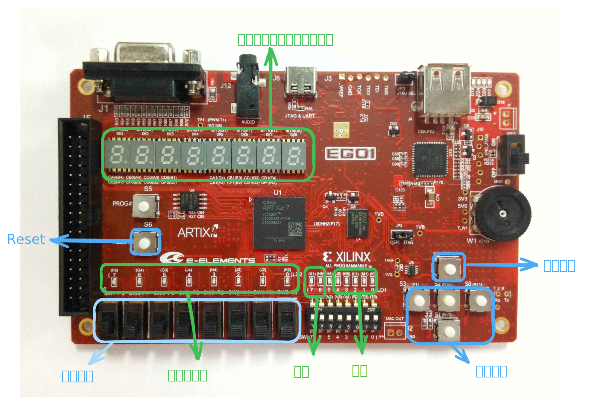
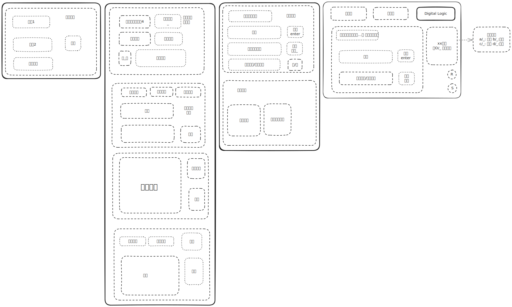

# DigitLogic_project

## Description

This is the project for the Digital Logic H course in the 2024 Spring semester. The project is about designing the **Basic Computational Learning Device for Programmers**

## Team Members

## Team's development plan

The team's development plan is as follows:

| Task | Member | Plan Date |
|------|--------|-----------|
|初始化及开关机和模式切换功能|刘瑞羽|13周中|
|学习模式|魏正新|13周中|
|键盘外设功能|王子恒|13周中|
|计算功能|刘瑞羽|14周|
|竞赛模式|魏正新|14周|
|VGA显示功能|王子恒|14周|
|整合功能|刘瑞羽，魏正新，王子恒|15周|

## Device Description

The input and output devices used in the EGO1 development board are as follows:

## UI Design

我们准备使用VGA显示器来显示我们的UI界面，我们初步的UI界面设计如下：

